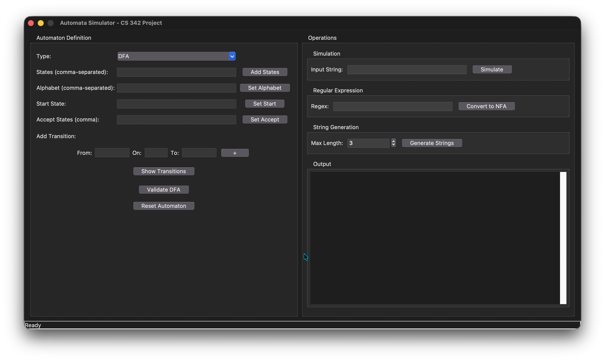

# Automata Simulator

A desktop application developed in **Python** using **Tkinter** that allows users to create, edit, and simulate **Deterministic Finite Automata (DFA)** and **Nondeterministic Finite Automata (NFA)** through an intuitive graphical interface.

This project was developed for the **CS 342 – Automata Theory** course to demonstrate the practical implementation of finite automata concepts.

---

## Features

* Create and edit DFA and NFA machines
* Add states, alphabet symbols, start state, and accept states
* Create transitions between states
* Validate DFA structure
* Simulate input strings
* Generate accepted strings up to a specified length
* Display all transitions
* Reset the automaton at any time
* Clean graphical user interface built with Tkinter

---

## Technologies Used

* Python 3
* Tkinter
* ttk Widgets
* Object-Oriented Programming (OOP)

---

## Project Structure

```text
AutomataSimulator/
│
├── run.py                     # Application entry point
├── automata_simulator_gui.py  # Main GUI and automata logic
└── README.md
```

---

## Getting Started

### Prerequisites

* Python 3.10 or later

### Installation

Clone the repository:

```bash
git clone https://github.com/Kh4ht/Automata-Simulator.git
```

Move into the project directory:

```bash
cd AutomataSimulator
```

Run the application:

```bash
python run.py
```

---

## How to Use

1. Select the automaton type (DFA or NFA).
2. Add the states.
3. Define the alphabet.
4. Specify the start state.
5. Specify one or more accept states.
6. Add transitions.
7. Validate the DFA (optional).
8. Simulate input strings.
9. Generate accepted strings up to a chosen maximum length.

---

## Current Functionality

* ✅ DFA Simulation
* ✅ NFA Simulation
* ✅ DFA Validation
* ✅ Transition Management
* ✅ String Generation
* ✅ Graphical Interface
* 🚧 Regular Expression → NFA conversion (planned)

---

## Screenshots

Add screenshots here.

Example:

```markdown



```

---

## Learning Outcomes

This project helped strengthen my understanding of:

* Finite Automata (DFA & NFA)
* Automata Theory
* Python GUI development with Tkinter
* Event-driven programming
* Object-Oriented Programming
* State machine implementation
* Input validation and user interaction

---

## Future Improvements

* Regular Expression → NFA conversion
* DFA minimization
* NFA to DFA conversion
* Graphical state diagram visualization
* Save and load automata
* Export automata definitions
* Step-by-step simulation animation

---

## Author

**Khaled Tamimi**

Computer Science Graduate

---

## License

This project is intended for educational purposes.
